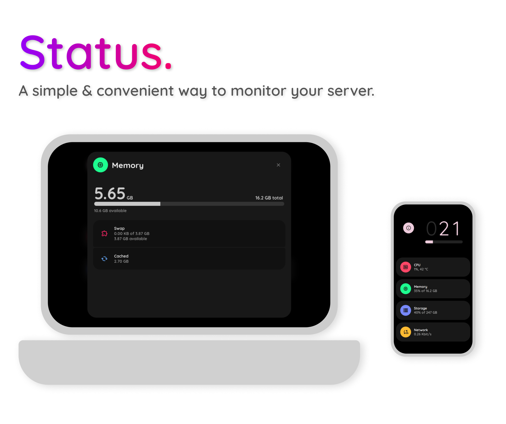
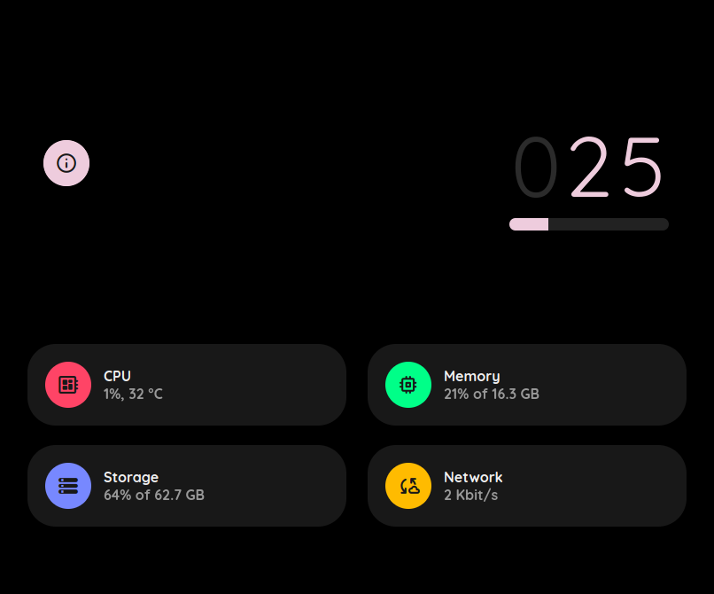
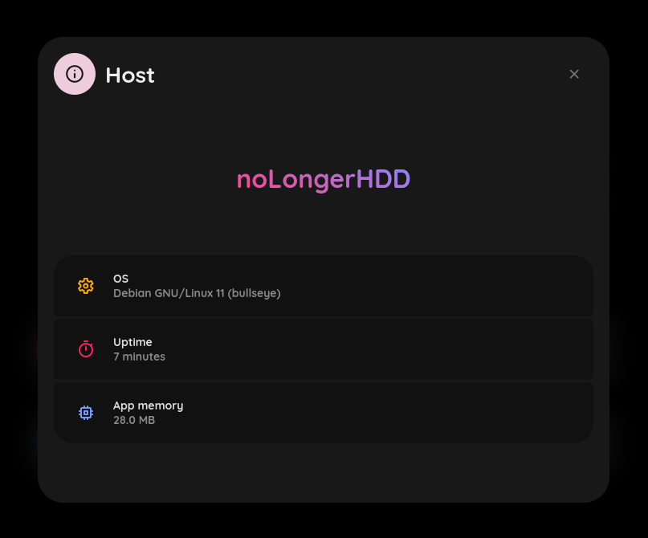
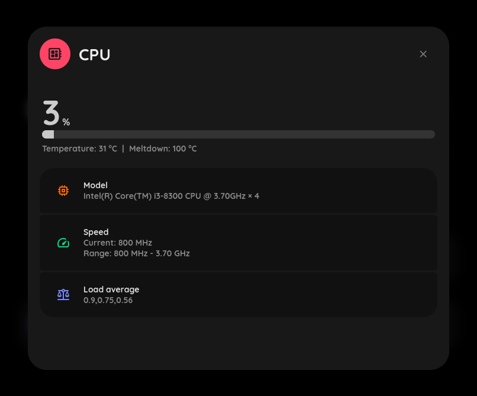
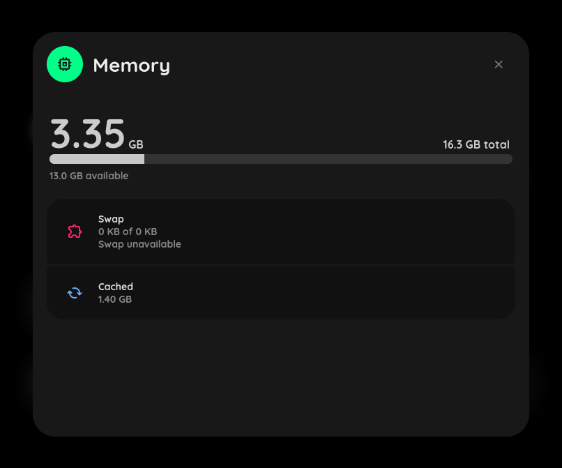
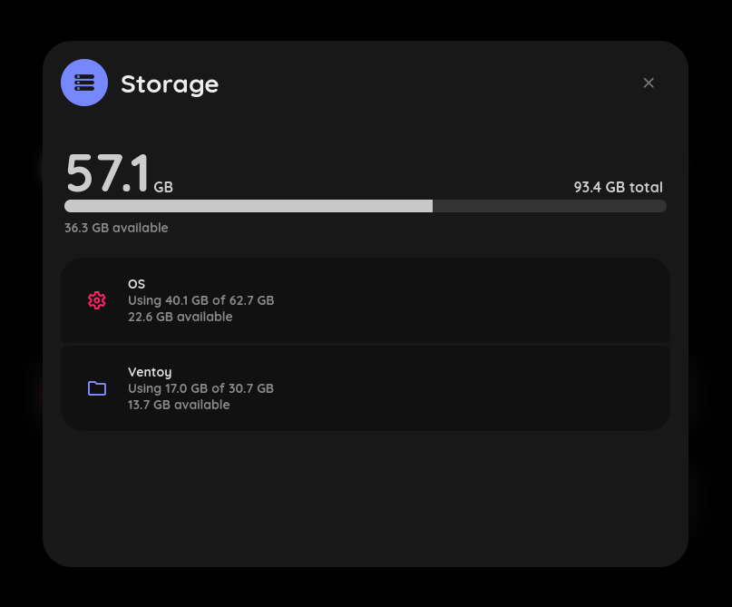
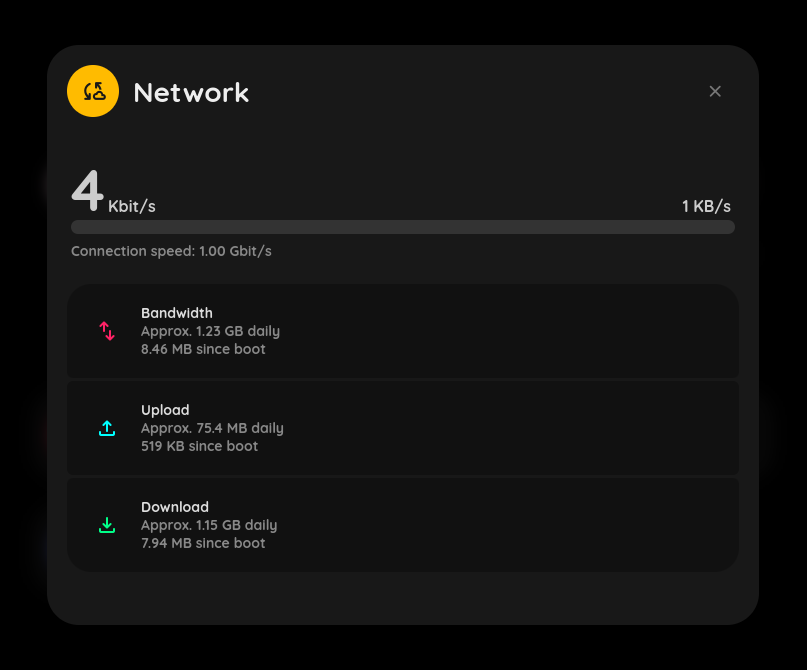

## 🧐 What is it?

A simple server monitoring app written in Python.
Designed to be lightweight, simple and pleasant to use.

It utilizes virtual file systems (/proc, /sys) for resource measurements, for maximum speed & simplicity.




<br>




## 🚀 Installation

**A Linux machine is required.**
Tested on some AMD and Intel computers.
Moreover, seems to work fine on Raspberry Pis.
Virtual isolated environments might cause unexpected behaviour.

<u>The best way is to host it on **bare metal**</u>.

### Clone the repo:

```
git clone https://gitlab.com/dani3l0/status && cd status
```

### Install required dependenc(y):

```
pip install -r requirements.txt
```

### And, simply run the app:

```
python3 status.py
```

**Status is now served on [localhost:9000](http://localhost:9000).**


## 📝 Configuration

**Note:** `config.json` file is created under first run!

**IMPORTANT: <u>Do not delete</u> the config keys, otherwise app won't start!**

| Section   | Key                 | Description                                                                                                                                                                                                                                                                                         |
|-----------|---------------------|-----------------------------------------------------------------------------------------------------------------------------------------------------------------------------------------------------------------------------------------------------------------------------------------------------|
| `server`  | `port`              | HTTP(S) port Status is listening on                                                                                                                                                                                                                                                                 |
| `server`  | `bind_address`      | Address Status is listening on                                                                                                                                                                                                                                                                      |
| `server`  | `domain`            | Domain name, enables HTTPS with Let's Encrypt certificates (example: `minipc.mydomain.com`)                                                                                                                                                                                                         |
| `machine` | `network_interface` | A network interface name we want to be measured. `auto` for auto-detection, otherwise set a desired interface name, like `eno1`                                                                                                                                                                     |
| `machine` | `hwmon_sensor`      | **Source of temperature values.** It's a hwmon sensor name for temperature measurement.<br>Some devices might have different sensor name (like Raspberry Pis having `cpu_thermal`).<br>**If you see unknown temperatures**, check `cat /sys/class/hwmon/*/name` for list of available sensor names. |
| `machine` | `auto_fs`           | Auto-detect mounted disks & partitions                                                                                                                                                                                                                                                              |
| `machine` | `disks`             | Describes which disks/partitions we want to have listed, **please see below**.<br>Ignored when `auto_fs` is set to `true`.                                                                                                                                                                          |
| `misc`    | `aiohttp_quiet`     | Disables HTTP library exceptions and debugging stuff. For **development**, please use `false`.                                                                                                                                                                                                      |


### 💾 Disks (manual config, works only when `auto_fs` is set to `false`)

**Here's the single disk definition from default config:**

```
"Primary": ["/", "folder", "#F66"]
```

`Primary` - desired disk/partition name to be shown in app

`/` - path of the target filesystem

`folder` - icon name, see [Google Icon Fonts](https://fonts.google.com/icons)

`#F66` - HEX color of the icon


**Example multi-disk config:**

```
"disks": {
    "OS": ["/", "settings", "#F66"],
    "Files": ["/home", "folder", "#68F"],
    "Backups": ["/mnt/backups", "backup", "#0D8"]
}
```

## ⬇️ Updating

This will reset your local changes and download the latest version from here.

**Go to your working directory and type the following:**

```
git reset
git pull
```
