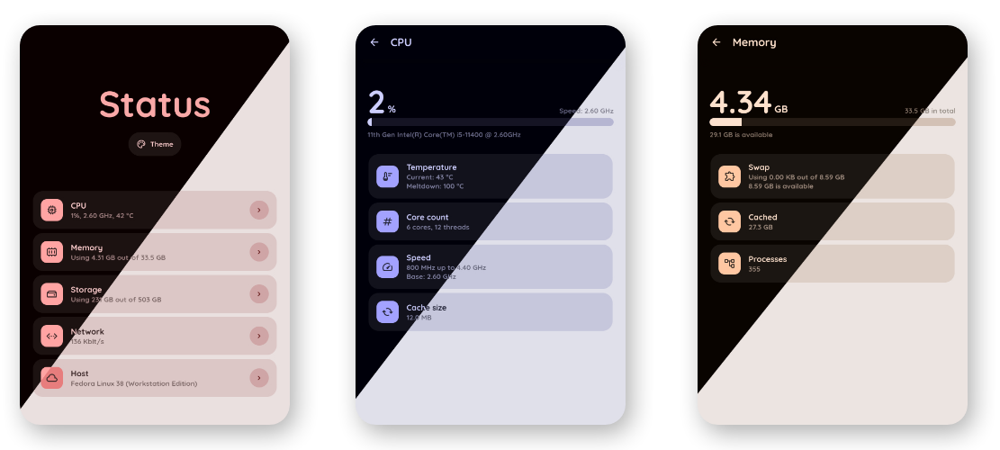

**:warning: Project in maintenance mode**. This means no new features will appear, only bug fixes. For more info, see **[Announcement](announcement.md)**.

## :thinking: What is it?

:information_source: **Status** is a simple, lightweight system monitoring app for small homeservers running Linux.
It utilizes virtual filesystems (like `/sys`, `/proc` etc.) to retrieve information and give it to end user via nice web interface.

:balance_scale: **Status** provides a good  balance between power and simplicity.

:runner: Runs flawlessly on most desktop computers, mini PCs and Raspberry Pis. However, virtual isolated environments may cause problems.

:tv: **[Check the live demo!](https://status.enshittification.social/)** (hosted by [Codixer](https://github.com/Codixer), see [#6](https://github.com/dani3l0/Status/issues/6))


## :rocket: Installation

This will take you just a few seconds. It's up to you which one you choose :)

### :hammer: Bare-metal

**:heavy_check_mark: Recommended.** Status has access to all virtual filesystems in your OS, which means more information and most reliable values.

```
# Clone the repo
git clone https://github.com/dani3l0/Status && cd Status

# Install required modules
pip3 install -r requirements.txt

# Run Status!
python3 status.py
```

### :whale: Docker

**It just works.** Most of features should run without hassle, but depending on your OS configuration you may notice some minor limitations.

```
# Clone the repo
git clone https://github.com/dani3l0/Status && cd Status

# Build & run app
docker-compose up -d
```

App should be available on [localhost:9090](http://localhost:9090).


## :wrench: Configuration

Status can be configured in multiple ways:

1. **:desktop_computer: Command line arguments** - the most important and will override everything.

2. **:national_park: environment variables** - will override configuration file.

3. **:memo: configuration file** - the least important, overrides default configuration only.

It's good not to mix them. Use `--help` for more information.

#### :pencil2: Config keys naming

Config keys are named slightly differently under different ways of configuration. Look at the table:

|                | in JSON config      | Environment variable        | Command line argument |
|----------------|---------------------|-----------------------------|-----------------------|
| **The rule**   | `{section}.{key}`   | `STATUS_{SECTION}_{KEY}`    | `--{section}-{key}`   |
| **Example #1** | `server.port`       | `STATUS_SERVER_PORT`        | `--server-port`       |
| **Example #2** | `server.address`    | `STATUS_SERVER_ADDRESS`     | `--server-address`    |
| **Example #3** | `misc.debug`        | `STATUS_MISC_DEBUG`         | `--misc-debug`        |

Command line offers `--config` (or `-c`) to set custom config location.

Running Status with `--no-config` will neither read nor write any configuration file. Overrides `--config`.
